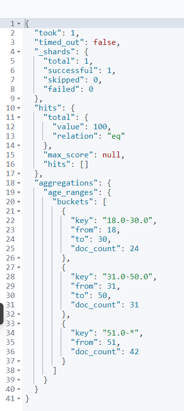

# 《实验三：Elasticsearch 聚合操作练习》
学院：省级示范性软件学院

题目：《实验二：聚合操作》

姓名：赵文胤

学号：2200770084

班级：软工2202

日期：2024-10-28

实验环境：Elasticsearch8.15.0 Kibana8.15.0


## 一、实验内容
### 电商数据分析：
索引表述信息：
1 order_id: 订单ID

2 order_date: 订单日期

3 customer_id: 客户ID

4 customer_name: 客户姓名

5 customer_gender: 客户性别

6 customer_age: 客户年龄

7 customer_city: 客户所在城市

8 product_id: 产品ID

9 product_name: 产品名称

10 product_category: 产品类别

11 quantity: 购买数量

12 price: 单价

13 total_amount: 总金额

14 payment_method: 支付方式

15 is_returned: 是否退货

创建索引语句

PUT /ecommerce
```JSON
{
    "mappings": {
        "properties": {
        "order_id": { "type": "keyword" },
        "order_date": { "type": "date" },
        "customer_id": { "type": "keyword" },
        "customer_name": { "type": "keyword" },
        "customer_gender": { "type": "keyword" },
        "customer_age": { "type": "integer" },
        "customer_city": { "type": "keyword" },
        "product_id": { "type": "keyword" },
        "product_name": { "type": "keyword" },
        "product_category": { "type": "keyword" },
        "quantity": { "type": "integer" },
        "price": { "type": "float" },
        "total_amount": { "type": "float" },
        "payment_method": { "type": "keyword" },
        "is_returned": { "type": "boolean" }
        }
    }
}
```


### 导入数据：

POST /ecommerce/_bulk

题目：

#### 1 统计每个产品类别的总销售额。

GET /ecommerce/_search
```json

{
  "size": 0,
  "aggs": {
    "total_sales_by_category": {
      "terms": { "field": "product_category" },
      "aggs": {
        "total_sales": { "sum": { "field": "total_amount" } }
      }
    }
  }
}
```

#### 2计算每个城市的平均订单金额。
GET /ecommerce/_search
```json

{
  "size": 0,
  "aggs": {
    "avg_order_amount_by_city": {
      "terms": { "field": "customer_city" },
      "aggs": {
        "avg_order_amount": { "avg": { "field": "total_amount" } }
      }
    }
  }
}
```


#### 3找出销量最高的前5个产品。

GET /ecommerce/_search
```json

{
"size": 0,
"aggs": {
"top_selling_products": {
"terms": { "field": "product_name", "size": 5 },
"aggs": {
"total_quantity_sold": { "sum": { "field": "quantity" } }
}
}
}
}
```


#### 4计算男性和女性客户的平均年龄。

GET /ecommerce/_search
```json

{
"size": 0,
"aggs": {
"avg_age_by_gender": {
"terms": { "field": "customer_gender" },
"aggs": {
"average_age": { "avg": { "field": "customer_age" } }
}
}
}
}
```


#### 5统计每种支付方式的使用次数和总金额。


GET /ecommerce/_search
```json

{
"size": 0,
"aggs": {
"payment_method_stats": {
"terms": { "field": "payment_method" },
"aggs": {
"total_amount": { "sum": { "field": "total_amount" } },
"usage_count": { "value_count": { "field": "payment_method" } }
}
}
}
}
```


#### 6计算每月的总销售额。


GET /ecommerce/_search
```json

{
"size": 0,
"aggs": {
"monthly_sales": {
"date_histogram": {
"field": "order_date",
"calendar_interval": "month"
},
"aggs": {
"total_sales": { "sum": { "field": "total_amount" } }
}
}
}
}
```
```json
{
  "took": 19,
  "timed_out": false,
  "_shards": {
    "total": 1,
    "successful": 1,
    "skipped": 0,
    "failed": 0
  },
  "hits": {
    "total": {
      "value": 100,
      "relation": "eq"
    },
    "max_score": null,
    "hits": []
  },
  "aggregations": {
    "monthly_sales": {
      "buckets": [
        {
          "key_as_string": "2023-01-01T00:00:00.000Z",
          "key": 1672531200000,
          "doc_count": 12,
          "total_sales": {
            "value": 24381.61993408203
          }
        },
        {
          "key_as_string": "2023-02-01T00:00:00.000Z",
          "key": 1675209600000,
          "doc_count": 11,
          "total_sales": {
            "value": 18870.850006103516
          }
        },
        {
          "key_as_string": "2023-03-01T00:00:00.000Z",
          "key": 1677628800000,
          "doc_count": 10,
          "total_sales": {
            "value": 17959.33026123047
          }
        },
        {
          "key_as_string": "2023-04-01T00:00:00.000Z",
          "key": 1680307200000,
          "doc_count": 9,
          "total_sales": {
            "value": 18775.959869384766
          }
        },
        {
          "key_as_string": "2023-05-01T00:00:00.000Z",
          "key": 1682899200000,
          "doc_count": 10,
          "total_sales": {
            "value": 11713.169967651367
          }
        },
        {
          "key_as_string": "2023-06-01T00:00:00.000Z",
          "key": 1685577600000,
          "doc_count": 9,
          "total_sales": {
            "value": 6771.1600341796875
          }
        },
        {
          "key_as_string": "2023-07-01T00:00:00.000Z",
          "key": 1688169600000,
          "doc_count": 7,
          "total_sales": {
            "value": 9110.010131835938
          }
        },
        {
          "key_as_string": "2023-08-01T00:00:00.000Z",
          "key": 1690848000000,
          "doc_count": 8,
          "total_sales": {
            "value": 12135.870210647583
          }
        },
        {
          "key_as_string": "2023-09-01T00:00:00.000Z",
          "key": 1693526400000,
          "doc_count": 3,
          "total_sales": {
            "value": 8615.500122070312
          }
        },
        {
          "key_as_string": "2023-10-01T00:00:00.000Z",
          "key": 1696118400000,
          "doc_count": 6,
          "total_sales": {
            "value": 12106.000183105469
          }
        },
        {
          "key_as_string": "2023-11-01T00:00:00.000Z",
          "key": 1698796800000,
          "doc_count": 6,
          "total_sales": {
            "value": 8176.529968261719
          }
        },
        {
          "key_as_string": "2023-12-01T00:00:00.000Z",
          "key": 1701388800000,
          "doc_count": 9,
          "total_sales": {
            "value": 12509.620300292969
          }
        }
      ]
    }
  }
}
```


#### 7找出平均订单金额最高的前3个客户。


GET /ecommerce/_search
```json

{
"size": 0,
"aggs": {
"top_customers_by_avg_order": {
"terms": { "field": "customer_id", "size": 3 },
"aggs": {
"avg_order_amount": { "avg": { "field": "total_amount" } }
}
}
}
}
```


#### 8计算每个年龄段（18-30，31-50，51+）的客户数量。


GET /ecommerce/_search
```json

{
"size": 0,
"aggs": {
"age_ranges": {
"range": {
"field": "customer_age",
"ranges": [
{ "from": 18, "to": 30 },
{ "from": 31, "to": 50 },
{ "from": 51 }
]
}
}
}
}
```


#### 9计算每个产品类别的平均单价。


GET /ecommerce/_search
```json

{
"size": 0,
"aggs": {
"avg_price_by_category": {
"terms": { "field": "product_category" },
"aggs": {
"average_price": { "avg": { "field": "price" } }
}
}
}
}
```


#### 10找出订单数量最多的前5个城市。


GET /ecommerce/_search
```json

{
"size": 0,
"aggs": {
"top_cities_by_orders": {
"terms": { "field": "customer_city", "size": 5 },
"aggs": {
"order_count": { "value_count": { "field": "order_id" } }
}
}
}
}
```


#### 11计算每个季度的平均订单金额。


GET /ecommerce/_search
```json

{
"size": 0,
"aggs": {
"quarterly_avg_order_amount": {
"date_histogram": {
"field": "order_date",
"calendar_interval": "quarter"
},
"aggs": {
"avg_order_amount": { "avg": { "field": "total_amount" } }
}
}
}
}
```


#### 12统计每个产品类别中的商品数量。


GET /ecommerce/_search
```json

{
"size": 0,
"aggs": {
"product_count_by_category": {
"terms": { "field": "product_category" },
"aggs": {
"product_count": { "value_count": { "field": "product_id" } }
}
}
}
}
```


#### 13计算男性和女性客户的平均订单金额。

GET /ecommerce/_search
```json

{
"size": 0,
"aggs": {
"avg_order_amount_by_gender": {
"terms": { "field": "customer_gender" },
"aggs": {
"avg_order_amount": { "avg": { "field": "total_amount" } }
}
}
}
}
```


#### 14找出总销售额最高的前10个日期。

GET /ecommerce/_search
```json

{
"size": 0,
"aggs": {
"top_sales_dates": {
"terms": { "field": "order_date", "size": 10 },
"aggs": {
"total_sales": { "sum": { "field": "total_amount" } }
}
}
}
}
```


#### 15计算每个季度销售额最高的产品类别。

GET /ecommerce/_search
```json

{
  "size": 0,
  "aggs": {
    "sales_by_quarter": {
      "date_histogram": {
        "field": "order_date",
        "calendar_interval": "quarter"
      },
      "aggs": {
        "sales_by_category": {
          "terms": {
            "field": "product_category",
            "size": 1,
            "order": {
              "total_sales": "desc"
            }
          },
          "aggs": {
            "total_sales": {
              "sum": {
                "field": "total_amount"
              }
            }
          }
        }
      }
    }
  }
}
```


#### 16计算每天的订单数量，并显示7天移动平均值。

GET /ecommerce/_search
```json
{
  "size": 0,
  "aggs": {
    "daily_orders": {
      "date_histogram": {
        "field": "order_date",
        "calendar_interval": "day"
      },
      "aggs": {
        "order_count": {
          "cardinality": {
            "field": "order_id"
          }
        },
        "moving_avg": {
          "moving_fn": {
            "script": "MovingFunctions.unweightedAvg(values)",
            "window": 7,
            "buckets_path": "order_count"
          }
        }
      }
    }
  }
}
```


#### 17比较本月销售额与上月销售额的差异。

GET /ecommerce/_search
```json

{
"size": 0,
"aggs": {
"monthly_sales": {
"date_histogram": {
"field": "order_date",
"calendar_interval": "month"
},
"aggs": {
"total_sales": { "sum": { "field": "total_amount" } }
}
}
}
}
```


#### 18计算每周的总销售额，并找出销售额增长最快的一周。


GET /ecommerce/_search
```json

{
"size": 0,
"aggs": {
"weekly_sales": {
"date_histogram": {
"field": "order_date",
"calendar_interval": "week"
},
"aggs": {
"total_sales": { "sum": { "field": "total_amount" } }
}
}
}
}
```

