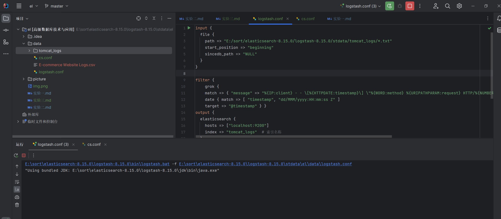
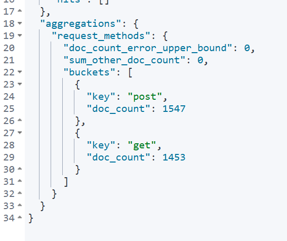

# 《实验二：索引操作与文档操作练习》

学院：省级示范性软件学院

题目：《实验四： Logstash操作》

姓名：赵文胤

学号：2200770084

班级：软工2202

日期：2024-11-01

实验环境：Elasticsearch8.15.0 Kibana8.15.0 Logstash8.15.0

## 一、实验目的

1. 掌握Tomcat日志处理的方法。
2. 学习如何将日志数据导入Elasticsearch。
3. 进行日志数据的分析和可视化。
4. 掌握数据转换和传输的基本操作。

## 二、实验内容

### 1.1 Tomcat日志处理

数据来源：本地的Tomcat的logs中的日志或使用提供的文件 tomcat_logs.zip。

解压tomcat_logs.zip文件，获取日志文件。解压带本地的数据文件夹


写配置文件为：

```conf
input {
  file {
    path => "E:/sort/elasticsearch-8.15.0/logstash-8.15.0/stdata/tomcat_logs/*.txt"
    start_position => "beginning"
    sincedb_path => "NULL"
  }
}

filter {
    grok {
    match => { "message" => "%{IP:client} - - \[%{HTTPDATE:timestamp}\] \"%{WORD:method} %{URIPATHPARAM:request} HTTP/%{NUMBER:http_version}\" %{NUMBER:response} %{NUMBER:bytes}" } }
    date { match => [ "timestamp", "dd/MMM/yyyy:HH:mm:ss Z" ]
    target => "@timestamp" } }
output {
  elasticsearch {
    hosts => ["localhost:9200"]
    index => "tomcat_logs"  # 索引名称
  }
  stdout { codec => rubydebug }  # 输出到控制台，便于调试

}
```

设置idea插件来配置路径


运行配置


导入成功


可以看到有这个索引


进行日志数据的5个自拟的分析。

#### 1. 每日访问量统计

GET /tomcat_logs/_search

```json
{
  "size": 0,
  "aggs": {
    "daily_requests": {
      "date_histogram": {
        "field": "@timestamp",
        "calendar_interval": "day"
      }
    }
  }
}
```

结果


#### 2. HTTP状态码分布

GET /tomcat_logs/_search

```json
{
  "size": 0,
  "aggs": {
    "status_codes": {
      "terms": {
        "field": "response",
        "size": 10
      }
    }
  }
}
```


#### 3. 请求方法分布

GET /tomcat_logs/_search

```json
{
  "size": 0,
  "aggs": {
    "request_methods": {
      "terms": {
        "field": "method",
        "size": 10
      }
    }
  }
}
```


#### 4. 访问来源IP统计

GET /tomcat_logs/_search

```json
{
  "size": 0,
  "aggs": {
    "client_ips": {
      "terms": {
        "field": "client",
        "size": 10
      }
    }
  }
}
```


#### 5. 请求路径统计

GET /tomcat_logs/_search

```json
{
  "size": 0,
  "aggs": {
    "request_paths": {
      "terms": {
        "field": "request",
        "size": 10
      }
    }
  }
}
```


### 1.2 数据转换和传输

1 将本地的mysql数据库中的一张表导入到本地的elasticsearch中。
2 数据库表更新后，数据能够自动同步到elasticsearch中。

```
input {
  jdbc {
    # JDBC 驱动程序的路径
    jdbc_driver_library => "C:/Users/zhao/Desktop/高级数据库/高级数据库作业/高级数据库技术与应用/数据/mysql-connector-j-9.1.0.jar"

    # JDBC 驱动程序的类名
    jdbc_driver_class => "com.mysql.cj.jdbc.Driver"

    # 数据库连接字符串
    jdbc_connection_string => "jdbc:mysql://localhost:3306/club"

    # 数据库用户名
    jdbc_user => "root"

    # 数据库密码
    jdbc_password => "123s123s"

    # 要执行的 SQL 查询
    statement => "SELECT * FROM activity"

    # 查询的时间间隔（例如，每分钟运行一次查询）
    schedule => "* * * * *"

  }
}
output {
  elasticsearch {
    hosts => ["localhost:9200"]
    index => "activity_index"
    document_id => "%{ActivityID}"
  }
  stdout { codec => rubydebug }  # 输出到控制台，便于调试

}

```

插入成功


索引如下：


可以自动更新
