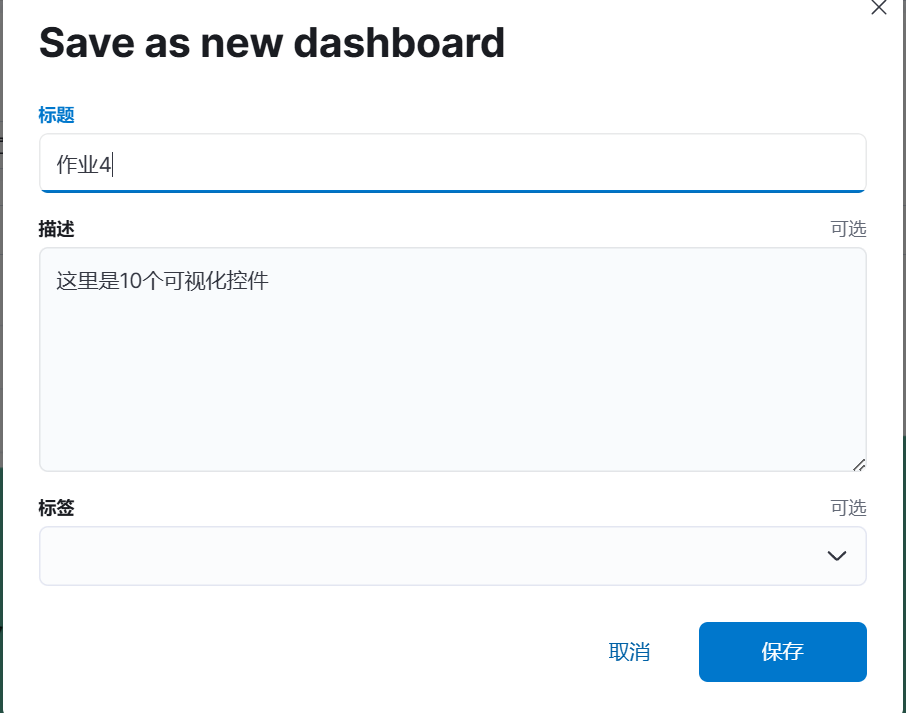

# 《实验三：Elasticsearch 聚合操作练习》
学院：省级示范性软件学院

题目：《实验五：Kibana操作》

姓名：赵文胤

学号：2200770084

班级：软工2202

日期：2024-11-6

实验环境：Elasticsearch8.15.0 Kibana8.15.0

## 1使用Kibana可视化图表完成实验三聚合操作的10道题

1 统计每个产品类别的总销售额。

2 计算每个城市的平均订单金额。

3 找出销量最高的前5个产品。

4 计算男性和女性客户的平均年龄。

5 统计每种支付方式的使用次数和总金额。

6 计算每月的总销售额。

7 找出平均订单金额最高的前3个客户。

9 计算每个产品类别的平均单价。

10 找出订单数量最多的前5个城市。

12 统计每个产品类别中的商品数量。

## 2 将做好的10个可视化放到1个或2个仪表盘中

放到了一个仪表盘中

## 3 仪表盘中增加一些控件，文字描述，筛选等

添加时间滑块控件

添加价格控件

添加描述

